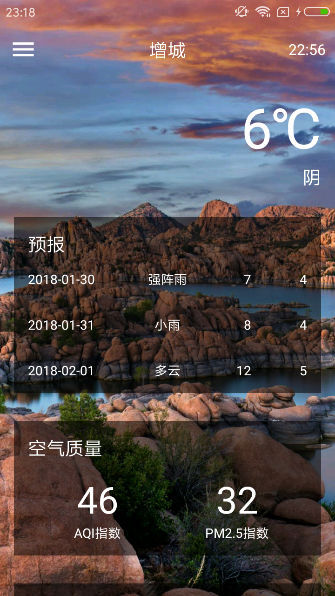
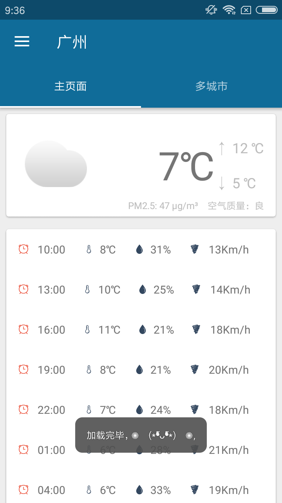

# Weather
天气应用App合集

## 天气App合集
### CoolWeather
可以列出全国所有的省、市、县;  
可以查看全国任意城市的天气信息;  
可以自由地切换城市，去查看其他城市的天气;  
可以手动更新以及后台自动更新天气  
PS:酷欧天气中的天气数据由和风天气提供，背景图片由必应提供.

原作者Github项目:[guolindev/CoolWeather](https://github.com/guolindev/booksource/tree/master/chapter14/CoolWeather)  

App体验:[Simplebam/coolweather](https://github.com/simplebam/Weather/releases/download/v1.0/coolweather-release_v1.0.apk)

### SeeWeather
就看天气——是一款遵循 Material Design 风格的只看天气的APP。  
卡片展现（当前天气情况，未来几小时天气情况，生活建议，一周七天概况）  
缓存数据，减少网络请求，保证离线查看  
内置两套图标（设置里更改）

原作者GitHub项目地址:[xcc3641/SeeWeather](https://github.com/xcc3641/SeeWeather)  

App体验:[就看天气 - fir.im](https://fir.im/kbdc) 
项目中的Project/seeweather_config.gradle配置仅仅属于SeeWeather的,模仿原项目,懒得改而已

### MVI框架学习Demo
* [MVI设计模式尝鲜（实现一个联网的天气查询Dome） - 简书](https://www.jianshu.com/p/dcb7b536066c)
* [［译］为什么使用MVI模式（MVI编写响应式安卓APP入门系列第一部分MODEL） - 简书](https://www.jianshu.com/p/f875e24acf95)
PS:框架学习还是需要等我学了MVP之后再来码这个项目

### 假装看天气

原作者GitHub项目地址:[li-yu/FakeWeather: 『假装看天气』─── 天气预报 & 公交
查询 & 资讯阅读 & 妹纸福利 的 Android 客户端](https://github.com/li-yu/FakeWeather)

App体验:[http://7xp1a1.com1.z0.glb.clouddn.com/FakeWeather/FakeWeather_v1.3.2_20180202.apk](http://7xp1a1.com1.z0.glb.clouddn.com/FakeWeather/FakeWeather_v1.3.2_20180202.apk)
PS:这个项目需要等到我完成毕业设计再弄,由于它推荐度不是很高,怕坑

### 最理想的天气App
* [zifangsky/WeatherSpider: 天气爬虫（全国城镇天气自动定时抓取更新，并开放
  RESTful查询接口），附带代理IP池定时更新并检测其可用性 ](https://github.com/zifangsky/WeatherSpider)
* [使用WebMagic+ActiveMQ实现全国城镇天气自动更新的A | zifangsky的个人博客](https://www.zifangsky.cn/901.html)
PS:自给自足(数据自己爬取提供是最靠谱的),其实我个人不是很喜欢和风天气,老是升级,我
   买郭霖第二行代码时候是x5(郭霖先生的书籍里面用的是x3),现在又不知道x几了,还不如
   用[全国天气预报数据接口_免费API接口调用-聚合数据](https://www.juhe.cn/docs/api/id/39)
   或者[全国天气预报 - Mob Api官网]( http://api.mob.com/#/apiwiki/weather)

## 接口数据
* [绝对干货：供个人开发者赚钱免费使用的一些好的API接口](https://mp.weixin.qq.com/s/mPF_WLz-oM4wklaoN6AGbA)
* [国内数据API接口集合](https://github.com/TonnyL/Awesome_APIs/blob/master/README-zh.md)  
PS:我基础比较薄弱,只会简单搭建一个web服务器,很多时候我都想去弥补这方面的知识,但
   很遗憾就是我Android开发经验少以及计算机网络底子差,所以想码两三个项目之后再去
   深入数据结构与算法,服务器那边的知识还得延迟,这样子就造成了我不会自己提供Api接
   口,总不能想做一个有想法的App就去求人帮忙(别人也很忙),万一想出了一个狂拽酷炫叼
   炸天的App而苦于知识限制了你的想象力,可能你当上CEO迎娶白富美走上人生巅峰的美梦
   就这样擦肩而过,哈哈哈,上面两个链接都很多免费Api,推荐一下

## 关于模仿项目的一些注意点
* 爬取网页数据的App,个人认为如果你有时间并且有兴趣了解网络(更多是爬取数据方面感
  兴趣),可以去模仿这类app,但如果你仅仅是看到它项目效果图而模仿的话,会遇到项目复
  杂度过大或者项目爬取的Api已经失效等问题
* 模仿的github项目star的要多,而且不老旧,我现在的思路都是模仿鸿洋先生公众号推荐
  的App,感兴趣建议你也关注一下,鸿洋公众号id:hongyangAndroid  
  几个优质的App推荐:[推荐几个优质完整项目](http://mp.weixin.qq.com/s/7ffZB0_RB90i5c60bEYRWg)
  以及[开源一款超级好用的mp3剪切器app](https://mp.weixin.qq.com/s/9OK1gJgsctnt6WA04LCYCA)  
  * 他推荐的App一般都是他先体验过可以才会推荐的,并且每一个都会给出自己的评价,不像
  某些博主为了推荐项目说一些狂拽酷炫叼炸天的功能(很多自己压根就没有体验),这一点我
  为鸿洋大神做法点个赞
  * 推荐项目太多,都想码,这里我建议先选择一个自己做为喜欢的,比如我就喜欢做有天气
    相关的App优先(这里不是一成不变,比如一个使用MVC框架,一个使用MVP框架那么就动
    手码,起码模仿的项目数据Api跪了,你最大优势就是可以把接口替换成类似项目的接口)
    ,当然,如果你适合一个项目就掌握MVP+Glide+Retrofit2+OKHttp+RxJava,那么是最
    好的,不过我属于那种思维较为笨的人,所以还是会选择逐一击破来学习
  * 选择一个知识点多于在自己现有知识点,但不要远远多于,比如[yangchong211/
    LifeHelper: 综合案例训练，包含新闻，视频，图片，音乐，记事本等等模块。
    架构模式：采用MVP+Rx+Retrofit+Desgin+Dagger2+阿里VLayout+腾讯X5+腾讯
    bugly。安装阿里编码规约插件，不断修正不合理代码和最大程度去除黄色警告](https://github.com/yangchong211/LifeHelper)
    或者[OCNYang/QBox: 小秋魔盒是一个生活工具 App，主要功能有：新闻资讯；
    微信精选美文；笑话趣图；星座运势；LED字幕；天气；日历；二维码；手电筒；
    老黄历。在开发中尽可能多的用了目前比较流行的框架和库。](https://github.com/OCNYang/QBox)
    以上这两个随便一个你搞出来相信都是中高级开发工程师了,但如果你水平跟我差不多,
    还是选择稳定升级知识好一点

## 推荐项目
* [DanteAndroid/Beauty: Just watch girls.](https://github.com/DanteAndroid/Beauty)
  * 推荐理由:没有MVP繁琐,但里面却涉及了Retrofit + Rxjava，让网络请求和解析数据更轻松、直观
  * 只保留了 Knowledge 中的美图功能，结构清晰更适合新手学习
  * 使用BRVAH，妈妈再也不用担心我写adapter头疼的问题了
* 论文准备模仿的App:[我的音乐-Musicoco 音乐](https://github.com/DuanJiaNing/Musicoco)

## 推荐阅读
* [Android开发进阶1-思维改变-如何知道我需要学什么（上）](https://mp.weixin.qq.com/s/eG6Gnfm_cevPnNrFa7ljUQ)
* [Android开发进阶2-招聘信息分析-如何知道我需要学什么（下）](https://mp.weixin.qq.com/s/ieQuNXLgrB3KiZGRqmqDKA)
* [黑科技：如何通过各种渠道获取学习资料 ](https://mp.weixin.qq.com/s/vv0A42qNQWbCA_bFR4a6xg)
* [成熟不是懂得更多，而是能容不同](http://mp.weixin.qq.com/s/PPuCGALnYPb-aItsCjVpgw)
* [你的容貌出卖了你的生活品质](http://mp.weixin.qq.com/s/7-umTBF098QNf_Gbh1w8rg)

## Support
最近在项目中学习,在项目中成长,所以亲们会看到我在项目里面写博客啦,哈哈哈  
如果你喜欢这个repository，请我喝杯咖啡，我会让它更完美~  

