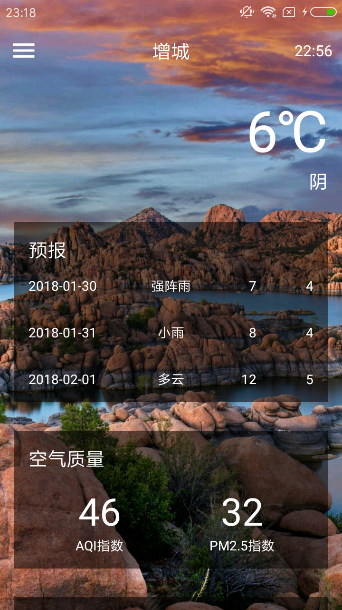
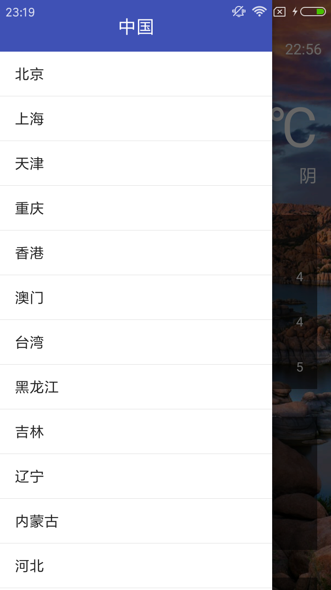

## CoolWeather
可以列出全国所有的省、市、县;  
可以查看全国任意城市的天气信息;  
可以自由地切换城市，去查看其他城市的天气;  
可以手动更新以及后台自动更新天气  
PS:酷欧天气中的天气数据由和风天气提供，背景图片由必应提供.

原作者Github项目:[guolindev/CoolWeather](https://github.com/guolindev/booksource/tree/master/chapter14/CoolWeather)  

### 项目中用到的链接须知
* 如果使用郭霖先生的连接[http://guolin.tech/api/weather?cityid=CN101280103&key=bc0418b57b2d4918819d3974ac1285d9](http://guolin.tech/api/weather?cityid=CN101280103&key=bc0418b57b2d4918819d3974ac1285d9)
  的话,Utility类中的静态方法handleWeatherResponse中的getJSONArray("HeWeather5");中的键需要改为和风天气的
  x3接口中的key
* 如果使用和风天气现在的x5接口链接:[https://free-api.heweather.com/v5/weather?city=CN101280103&key=b9e05332eea2426fb74de09c14c77227](https://free-api.heweather.com/v5/weather?city=CN101280103&key=b9e05332eea2426fb74de09c14c77227)
  ,Utility类中的静态方法handleWeatherResponse中的getJSONArray("HeWeather5");中的键需要改为和风天气的x3接
  口中的key:HeWeather5
* 在和风天气的连接中,可以使用city=weather_id或者city=cityName,其中cityName城市名字可以为拼音,但如果是中文,
 需要使用URLEncoder.encode(cityName,"UTF-8");
* 自己爬取了每日一图,这里也可以使用每日一图其他链接:[必应每日壁纸-易源接口总线
  -api接口中心](https://www.showapi.com/api/lookPoint/1287)
  或者[5种方法获取Bing每日图片 附送高清API接口及网站背景调用-缙哥哥的博客](https://www.dujin.org/fenxiang/jiaocheng/3618.html)

 
### 期待的V2.0版本:
* 下一个版本需要解决的问题:替换郭霖先生里面全部个人链接,更改为和风官网给出的链接

  
  