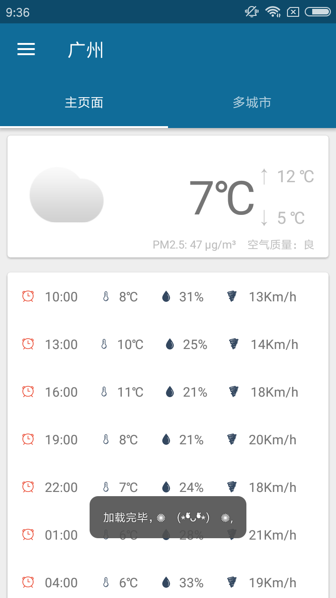

## SeeWeather
就看天气——是一款遵循 Material Design 风格的只看天气的APP。 <br/>
卡片展现（当前天气情况，未来几小时天气情况，生活建议，一周七天概况） <br/>
缓存数据，减少网络请求，保证离线查看 <br/>
内置两套图标（设置里更改）

原作者Github项目:[xcc3641/SeeWeather](https://github.com/xcc3641/SeeWeather) <br/>
<a href="../art/seeweather_home.jpg"></a><a href="../art/seeweather_setting.jpg"></a>


### 项目中用到的知识
* 开发规范:[Android 开发规范（完结版） - 简书](https://www.jianshu.com/p/45c1675bec69)
* Gradle
   * [Android Gradle权威指南](http://www.java1234.com/a/javabook/andriod/2018/0117/10280.html)
     网上还出了《实战Gradle》以及《Gradle for Android 中文版》等Gradle书籍,其
     实Gradle书籍一般都会存在知识点不齐全问题,所以我建议选择这本入门,之后结合百
     度或者博客等获取到你需要的Gradle知识即可
   * [新一代构建工具gradle-慕课网](https://www.imooc.com/learn/833)
* 压缩图片:[TinyPNG – Compress PNG](https://tinypng.com/),目前我遇到最好用
  的图像压缩在线网站,一般开发中用的图片都需要经过压缩,现在网上很多压缩网站都是压
  缩完的图片,带水印免费,无水印需要你开会员,真恶心!!!
* Android基础:
  * Android基础知识复习:[尚硅谷15天Android基础(复习笔记) - CSDN博客](http://blog.csdn.net/simplebam/article/details/70213167)
  * 四大组件:
     * Activity:
        * 启动模式:[Activity的四种启动模式-图文并茂 – Android开发中文站](http://www.androidchina.net/3173.html)
        * 状态保存与恢复:[Android Activity 和 Fragment 状态保存与恢复的最佳实践](https://www.jianshu.com/p/45cc7775a44b)
        * 动画切换:[酷炫的Activity切换动画，打造更好的用户体验 - 简书](https://www.jianshu.com/p/37e94f8b6f59)
        * 标签属性:[Android Activity标签属性 - 简书](https://www.jianshu.com/p/8598825222cc)
     * PreferenceActivity:
        * [Android开发之PreferenceActivity的使用 - 简书](https://www.jianshu.com/p/4a65f4a912c6)
        * [Preference 三种监听事件说明 - wangjicong_215的博客 - CSDN博客](http://blog.csdn.net/wangjicong_215/article/details/52209380)
     * Fragment
        * [实现Activity和Fragment之前通信 - CSDN博客](http://blog.csdn.net/xuxian361/article/details/75529810)
        * [死磕 Fragment 的生命周期 - MeloDev的博客 - CSDN博客](http://blog.csdn.net/MeloDev/article/details/53406019)
        * [android fragment onHiddenChanged的使用 - CSDN博客](http://blog.csdn.net/bzlj2912009596/article/details/62851537)
           ,这里是为了解释第二篇博文准备的
        * [Fragment的setUserVisibleHint方法实现懒加载，但
          setUserVisibleHint 不起作用？ - Leevey·L - 博客园](http://www.cnblogs.com/leevey/p/5678037.html)
          ,这里是为了解释第二篇博文准备的
        * [TabLayout使用详解 - 简书](https://www.jianshu.com/p/7f79b08f5afa)
          ,这里是为了解释第二篇博文准备的
        * [套在ViewPagerz中的Fragment在各种状态下的生命周期 - CSDN博客](http://blog.csdn.net/jemenchen/article/details/52645380)
        * [Android -- Fragment 基本用法、生命周期与细节注意 - 简书](https://www.jianshu.com/p/1ff18ec1fb6b)
        * [Fragment全解析系列（一）：那些年踩过的坑 - 简书](https://www.jianshu.com/p/d9143a92ad94)
          ,这系列的四篇都很经典,建议你可以看看
        * 还不知道怎么入门解析Fragment的可以看我的面经,里面涉及了(卖个广告),
          [Android面经-基础篇(持续更新...) - CSDN博客](http://blog.csdn.net/simplebam/article/details/77989675)
        * 关于保存和恢复Fragment目前最正确的状态:[The Real Best Practices to Save/Restore Activity's and Fragment's state. (StatedFragment is now deprecated)](https://inthecheesefactory.com/blog/fragment-state-saving-best-practices/en)
     * 关于BaseActivity跟BaseFragment的封装:[从BaseActivity与BaseFragment
       的封装谈起 - Young_Kai]( http://blog.csdn.net/tyk0910/article/details/51355026)
* Material Design:
   * [Android Theme.AppCompat 中，你应该熟悉的颜色属性 - 简书 ](https://www.jianshu.com/p/15c6397685a0)
      这家伙的关于MD文章也是值得一看的,简短but精辟
   * ToolBar:
      * [ToolBar使用心得(如何改变item的位置) - 泡在网上的日子](http://www.jcodecraeer.com/plus/view.php?aid=7667)
      * [Toolbar+DrawerLayout+NavigationView使用心得](http://www.jcodecraeer.com/a/anzhuokaifa/2017/0317/7694.html)
      * [Android ToolBar 使用完全解析 - 简书]( https://www.jianshu.com/p/ae0013a4f71a)
   * CoordinatorLayout(本身就是一个加强版的FrameLayout)可以监听其所有子控件
      的各种事件,然后自动帮助我们做出最为最为合理的响应 <--(寄生) AppBarLayout
      (垂直的LinearLayout加强版),它在内部做了很多滚动事件的封装 <--(寄生)
      CollapsingToolBarLayout(可折叠式标题栏)
   * CoordinatorLayout:
      * [CoordinatorLayout与滚动的处理-泡在网上的日子](http://www.jcodecraeer.com/a/anzhuokaifa/androidkaifa/2015/0717/3196.html)
      * [实现折叠式Toolbar：CollapsingToolbarLayout 使用完全解析 - 简书](https://www.jianshu.com/p/8ce727308f29)
   * DrawLayout:
      * [android官方侧滑菜单DrawerLayout详解 - 泡在网上的日子](http://www.jcodecraeer.com/a/anzhuokaifa/androidkaifa/2014/0925/1713.html)
      * [用Android自带的DrawerLayout和ActionBarDrawerToggle实现侧滑效果](http://blog.csdn.net/miyuexingchen/article/details/52232751)
      * [Drawer 详解 ·Material Design Part 3 - Android - 掘金](https://juejin.im/entry/5825c76d67f3560058d23657)
   * RecyclerView:
      * [RecyclerView简单使用总结 - 简书](https://www.jianshu.com/p/9b3949f7cb0f)
      * [RecyclerView使用完全指南，是时候体验新控件了（一） - 简书](https://www.jianshu.com/p/4fc6164e4709)
   * SwipeRefreshLayout:
      * [SwipeRefreshLayout详解和自定义上拉加载更多 - 简书 ](https://www.jianshu.com/p/d23b42b6360b)
      * [SwipeRefreshLayout+RecyclerView冲突的几种解决方案 - 简书](https://www.jianshu.com/p/34cbaddb668b)
   * NestedScrollView:
      * [一点见解: Android嵌套滑动和NestedScrollView - 简书](https://www.jianshu.com/p/1806ed9737f6)
      * [NestedScrollView+RecyclerView优雅的解决滑动冲突问题 - 简书](https://www.jianshu.com/p/791c0a4acc1c)
   * 看不懂物料设计的话建议买郭霖先生的《第二行代码》好一点，这本书内容对于初级
     开发者来说还是蛮不错的
   * [Android布局优化之ViewStub、include、merge使用与源码分析 - CSDN博客](http://blog.csdn.net/bboyfeiyu/article/details/45869393)
* RxBus
   * [Android RxBus的使用 - Angelica - CSDN博客 ](http://blog.csdn.net/qq_20785431/article/details/72910619)
   * [RxJava 的 Subject - 简书](https://www.jianshu.com/p/99bd603881bf)
   * [RxBus | 吴小龙同學]( http://wuxiaolong.me/2016/04/07/rxbus/)
* Http知识:
   * [你应该知道的计算机网络知识 - 简书](https://www.jianshu.com/p/21b5cbac0849)
   * [Android中的Http通信（一）之Http协议基本知识 - CSDN博客](http://blog.csdn.net/u014544193/article/details/49849843)
   * [Android之基于HTTP协议的通信详解 - 一叶飘舟 - 博客园](http://www.cnblogs.com/jdsjlzx/archive/2011/07/25/2116351.html)
* Notification通知
   * [全面解析Notification - CSDN博客 ](http://blog.csdn.net/u012124438/article/details/53574649)
   * 这里有一个问题的,就是Builder里面方法setProgress(int max, int progress,
      boolean indeterminate)的第三个参数indeterminate问题,这里有讲解,好好细
      看:[Android官方开发文档Training系列课程：通知用户之在通知中显示进度](http://www.bubuko.com/infodetail-1630910.html)
   * [PendingIntent.getActivity的使用 - 博客园](https://www.cnblogs.com/lyxin/p/5995681.html)
   * "给大家躺个坑，实用Android.support.v4.app.NotificationCompat.BigTextStyle
     的时候，当你的文本内容有感叹号的时候你的通知不会显示出来，还没有具体看源码是
     什么原因......我用的魅族PRO5，大家遇到了就将文本中的感叹号替换掉就可以了",
     在网址[Notification常见样式总结 - 简书](https://www.jianshu.com/p/6c89c3792b90)
     评论区看到

### 项目中的用到的开源框架
* ButterKnife
  * [ButterKnife8.5.1 使用方法教程总结 - CSDN博客](http://blog.csdn.net/niubitianping/article/details/54893571)
* OrmLite-Android高性能数据库框架
  * [Android 快速开发系列之数据库篇（LiteOrm） -简书](https://www.jianshu.com/p/0d72226ef434)
  * [litesuits/android-lite-orm](https://github.com/litesuits/android-lite-orm)
  * 由于OrmLite已经很久没有更新以及没有使用Gradle配置方式,这里我个人建议大家可
    以尝试使用郭霖先生的LitePal(原理上跟OrmLite一样的),升级数据库可以不清数据:
    [Android数据库高手秘籍(一)——SQLite命令 - 郭霖的专栏 - CSDN博客](http://blog.csdn.net/guolin_blog/article/details/38461239)
    以及[LitePal 1.6.0版本来袭，数据加解密功能保障你的应用数据安全](http://mp.weixin.qq.com/s/TSp36cnKLxUmAHjT86UCrQ)
* bugtags-移动时代首选 Bug 管理系统:[Bugtags 使用说明 - CSDN博客](http://blog.csdn.net/ObjectivePLA/article/details/51037804)
* Watcher-Help to watch the fps and used memory of your app(检测App的已用
  内存以及帧/秒)
  * [xcc3641/Watcher](https://github.com/xcc3641/Watcher)
* stetho-Android调试工具。它可以通过chrome的开发者工具来辅助安卓开发。
  * [stetho使用介绍 - 简书](https://www.jianshu.com/p/c03a8959d1a5)
* blockcanary-自动检测性能卡顿的工具
  * [找出造成Android App界面卡顿的原因- BlockCanary - 简书](https://www.jianshu.com/p/5d9eca9c343a)
  * [BlockCanary分析android卡顿 - bazhongren的博客 - CSDN博客](http://blog.csdn.net/bazhongren/article/details/51125113)
    这里我需要说明一点:就是这两篇介绍的继承类方法在新版BlockCanary里面的方法名
    字已经变更了,但其他是没什么变化的
* RxJava
   * 目前最好的RxJava入门文章,没有之一:[给初学者的RxJava2.0教程(一) - 简书 ](https://www.jianshu.com/p/464fa025229e)
     以及对应的项目教程源码:[ssseasonnn/RxJava2Demo](https://github.com/ssseasonnn/RxJava2Demo)
   * [这可能是最好的RxJava 2.x 教程（完结版）- 简书](https://www.jianshu.com/p/0cd258eecf60)
   * 其他RxJava文章推荐:[RxJava2 学习资料推荐](http://mp.weixin.qq.com/s/UAEgdC2EtqSpEqvog0aoZQ)
   * [RxJava之过滤操作符 - 行云间 - CSDN博客](http://blog.csdn.net/io_field/article/details/51378909)
   * [RxJava2使用过程中遇到的坑 - CSDN博客](http://blog.csdn.net/sr_code_plus/article/details/77189478)
   * [这是一份全面 & 详细 的RxJava操作符 使用攻略](http://mp.weixin.qq.com/s/2vDZ7h6SL-LR7n3FR6OMrw)
* RxPermissions-动态申请权限
   * [RxPermissions获取运行时权限 - 简书](https://www.jianshu.com/p/314e9e27592f)
   * 当用户选择了“不再提示+拒绝”之后的处理,只能移步到系统设置去打开权限了
   * 在onResume()中处理监听到设置了禁止后不再询问
* Retrofit
   * [你真的会用Retrofit2吗?Retrofit2完全教程 - 简书](https://www.jianshu.com/p/308f3c54abdd)
   * [Android Retrofit 2.0使用 | 吴小龙同學](http://wuxiaolong.me/2016/01/15/retrofit/)
   * [Android Retrofit 2.0 使用-补充篇 - 简书](https://www.jianshu.com/p/93153b34310e)
* rxlifecycle-管理RxJava生命周期
   * [RxAndroid之Rxlifecycle使用 - 享受技术带来的快乐 - CSDN博客](http://blog.csdn.net/jdsjlzx/article/details/51527542)
   * [Android 性能优化之利用 Rxlifecycle 解决 RxJava 内存泄漏 ](https://juejin.im/entry/58290ea2570c35005878ce8f)
* Gson-解析Json数据
  * 关于使用Alibaba的fastJson或者Google的Gson框架,我个人更喜欢使用Gson框架,
    不是因为fastJson不好,其实fastJson性能更优秀:[Android总结之json解析
    （FastJson Gson 对比）](http://www.cnblogs.com/whoislcj/p/5468420.html)
  * fastJson教程:[Android okHttp网络请求之Json解析 - 总李写代码 - 博客园](http://www.cnblogs.com/whoislcj/p/5533548.html)
  * Gson教程(这个作者写的这四篇Gson文章真的很好):[你真的会用Gson吗?Gson使用指
    南（一） - 简书 ](https://www.jianshu.com/p/e740196225a4)
* Glide
  * [Android图片加载框架最全解析（一），Glide的基本用法 - 郭霖的专栏](http://blog.csdn.net/guolin_blog/article/details/53759439)
    郭霖写的东西都很赞,值得推荐阅读
  * [Google推荐的图片加载库Glide介绍 - 泡在网上的日子](http://www.jcodecraeer.com/a/anzhuokaifa/androidkaifa/2015/0327/2650.html)
  * [Glide 一个专注于平滑滚动的图片加载和缓存库 - 简书](https://www.jianshu.com/p/4a3177b57949)
  * [Glide V4 框架新特性（Migrating from v3 to v4） - HeXinGen的博客 - CSDN博客](http://blog.csdn.net/hexingen/article/details/72578066)
* glide-transformations
  * 网上出现了很多Glide的图片变换开源库，其中做的最出色的应该要数glide-transformations这个库了
  * [Android图片加载框架最全解析（五），Glide强大的图片变换功能 - 郭霖](http://blog.csdn.net/guolin_blog/article/details/71524668)
  * [Glide、Picasso、Fresco进阶 - 图像转换 - 简书 ](https://www.jianshu.com/p/976c86fa72bc)
  * 还是不会用Glide的话,那么推荐使用[panpf/sketch: Sketch 是 Android 上一个
    强大且全面的图片加载器,支持 GIF，手势缩放以及分块显示超大图片](https://github.com/panpf/sketch)
    无需关心TAG，因为根本就不使用TAG来关联，也自带多种图片处理效果，圆形的、圆角
    的、高斯模糊的等等
* citypicker/crazyandcoder
  * [crazyandcoder/citypicker: citypicker城市选择器，详细的省市区地址信息，支持仿iOS滚轮实现，一级或者三级列表展示方式。](https://github.com/crazyandcoder/citypicker)

PS:debug情况下使用stetho以及Watcher,release版本使用bugstag(原项目使用bughd)
   ,这里无论是debug还是release都会使用bugstag来提交bug


### 项目开发遇到的问题
* 其实当AS升级到3.0之后,若项目之前用了类似retrolambda(原项目用了)或者Jack这种
  旧方案的话，会出现以下提示告诉你移除相关的代码：
  > Warning:One of the plugins you are using supports Java 8 language features. To try the support built into the Android plugin, remove the following from your build.gradle: apply plugin: ‘me.tatarka.retrolambda’ To learn more, go to https://d.android.com/r/tools/java-8-support-message.html

  解决办法:[Android Studio 3.0及Gradle Plugin 3.0升级注意事项](https://codezjx.github.io/2017/11/23/gradle-plugin-3-0-0-migration/)

* 之前的Gradle配置[Android 开发之版本统一规范](https://blankj.com/2016/09/21/android-keep-version-unity/)
  或者[android studio编程时出现的错误：Cannot get property 'XXXX' on extra
   properties extension as it does not exist - CSDN博客](http://blog.csdn.net/qq_22078107/article/details/53349836)
  ,都是直接在build.gradle里面配置的,第一次见另外起一个config.gradle来配置相关
  信息的,但配置了大概之后sync一下就出现下面的bug:
  > Error:(4, 0) Cannot get property 'android' on extra properties extension as it does not exist
    <a href="openFile:E:\acode\Android_Studio\Weather\seeweather\build.gradle">Open File</a>

  * 解决办法:在Project的build.gradle首部加上 apply from: 'config.gradle'
* 原项目开发使用的是[BugHD](http://bughd.com/doc/ios-version-update),但很
  遗憾就是它已经停止免费服务了,在这里我打算替换成[bugtags](https://www.bugtags.com/)
* 一般项目在开发中使用OkHttp时候常用就是logging-interceptor来作为Log信息拦截
  器,但还有就是使用FaceBook的[stetho(它可以通过chrome的开发者工具从而辅助安卓开发)](https://www.jianshu.com/p/c03a8959d1a5)
  ,查阅了很久才搞懂,mark一下
* 看到那么多Utils工具类的时候,一般使用常用工具类可以试试Blankj大神的[AndroidUtil](https://github.com/Blankj/AndroidUtilCode)
* 在原来的项目里面,清单文件里面的application标签里面出现下面两个属性
  ```
  android:hardwareAccelerated="true"
  android:largeHeap="true"
  ```
  这里我查阅了一下文章,[安卓manifest中的android:largeHeap="true"作用](http://blog.csdn.net/stimgo/article/details/69666621)
  以及[android学习——控制硬加速 hardwareAccelerated 在3.0才有的。](http://blog.csdn.net/janronehoo/article/details/7517284)
* 关于BaseApplication类引发的OnErrorNotImplementedException异常:
  ```
   (BaseApplication.java:54) io.reactivex.exceptions.OnErrorNotImplementedException: Attempt to invoke virtual method 'android.database.Cursor android.database.sqlite.SQLiteDatabase.query(java.lang.String, java.lang.String[], java.lang.String, java.lang.String[], java.lang.String, java.lang.String, java.lang.String)' on a null object reference
  ```
  我找了很久都没有找到是怎么回事,根据debug之后才发现是RxJava里面的bug,这里我注
  销了BaseApplication类相关的代码,代码如下:
  ```
          RxJavaPlugins.setErrorHandler(throwable -> {
              if (throwable != null) {
                  PLog.e(throwable.toString());
              } else {
                  PLog.e("call onError but exception is null");
              }
          });
  ```
* 关于权限申请问题,如下
  ```
   java.io.FileNotFoundException: /proc/stat (Permission denied)
  ```
  这个项目权限处理不够,不如之前模仿的项目[五次元妹子](https://github.com/DanteAndroid/Beauty)
  那么周全,这里我准备如下处理:
  * 本来打算存入本地让LitePal进行查询,但目前的问题是raw/china_city.db写不进去
    本地导致的,这里本来打算结合RxPermissions来弄的,可惜道行不够,被迫放弃,这里
    选用了开源第三方库[crazyandcoder/citypicker](https://github.com/crazyandcoder/citypicker)
    ,这里我把作者模块化city下面的类全注释了,这里开多了一个province模块
  * 缓存文件也放到内置内存卡去,如下
    ```
     sCacheDir = getApplicationContext().getCacheDir().toString();
    ```
* 原项目有个xml文件叫做"item_city.xml",而开源库[CityPicker](https://github.com/crazyandcoder/citypicker)
  冲突了(这个库里面也有一个xml文件叫做"item_city.xml"),所以我决定把它改为
  "item_city_adapter.xml"


### 项目中数据提供
* 天气数据:[和风天气 | 好用的气象数据服务 天气数据分析 天气商业化解决方案](https://www.heweather.com/)
  * 关于Weather实体设计的话,主要还是从和风天气那边的接口为准,在我码这个项目时候,
    和风天气的天气接口已经s6了,这里我将会使用v5作为接口,实体设计参考[https://free-api.heweather.com/v5/weather?city=CN101280103&key=b9e05332eea2426fb74de09c14c77227](https://free-api.heweather.com/v5/weather?city=CN101280103&key=b9e05332eea2426fb74de09c14c77227)
    或者seeweather/extra/weather.json文件(接口请求回来的),这里我有必要吐槽和
    风天气,老是淘汰旧接口而不断换用新接口,除了增加特性之外,我更觉得是为了清理旧
    接口从而缓解服务器压力,所以建议使用[Mob官网 - 为开发者提供各种数据以及API Service](http://api.mob.com/#/)
* App内测:[fir.im - 免费应用内测托管平台|iOS/Android应用内测分发](https://fir.im/)
  * 关于版本更新的话,fir会提供相关的接口,说明:[fir.im - 版本查询](https://fir.im/docs/version_detection)
    其中字段id是应用ID，我找不到"应用管理"的"基本信息",但在特定应用的URL找到,比
    如:[https://fir.im/apps/5a7425c1ca87a877b1a81c2a](https://fir.im/apps/5a7425c1ca87a877b1a81c2a)
    url中的apps/后面的一串数字便是应用ID;该接口返回的json数据可以参考json文件
    seeweather/extra/version.json
* 定位服务:[概述-Android 定位SDK | 高德地图API ](http://lbs.amap.com/api/android-location-sdk/locationsummary/)
  * 一般国内都是使用高德以及百度地图居多,至于搜狗地图,呵呵(去哪儿用的是这家,坑爆了)
  * 申请高德地图key时候,需要sha1以及PackageName,这里有讲哈:[如何获取注册高德Key使用的SHA1值与PackageName](http://lbs.amap.com/faq/top/hot-questions/249)
    ,这里keystore最好就是一个应用对应一个,重复的话会导致一些意外


### 开发中遇到的大神
* [吴小龙同学](http://wuxiaolong.me/),这博主的博客写的简洁精辟,现在Android
  很多文章水平参差不齐,但他的文章排版内容等都很清晰,赞一个
* [Blankj大牛](https://blankj.com/)
  * 这个大牛还真的在做个项目的时用到他很多知识才去了解的,现在发现他涉猎挺广的,
    关键是他还仅仅是大学生

 
## 推荐阅读-推荐的不仅仅是技术
* [初创团队的Android应用质量保障之道 - CSDN博客](http://blog.csdn.net/bboyfeiyu/article/details/73716633)
* [实战版本更新(okhttp3、service、notification)](http://mp.weixin.qq.com/s/nB5AnvltKfaF0yJNErOUFg)
* [基于Vert.x和RxJava 2构建通用的爬虫框架 - 简书](https://www.jianshu.com/p/e34b2113ce46)
* [2017年值得回首的那些事（文末有新春好礼相送）](https://mp.weixin.qq.com/s/bY-Mu6hvuxrvIP7YNnnUPw)
* [2017 Android 最全面试总结 - 这些面试题你一定需要 - Android - 掘金](https://juejin.im/entry/58b7a8f48d6d810065274ef1)
* [回顾下今年使用过的好用的插件、工具等](http://mp.weixin.qq.com/s/O6rErRjSOyPSt7DMFyYKUg)
* [这8种实习生的转正几率为0%](http://mp.weixin.qq.com/s/W3Og7Fz2aO09VlinM7WVcw)
